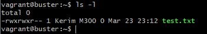

# M300 Dokumentation (Markdown)

## Einleitung

In meinem Markdown halte ich fest, was ich neues im Modul 300 gelernt habe und wie ich die vorgegebenen Aufgaben gelöst habe. Dies bedeutet aber auch, dass dies auch Fehlerbehebungen oder Umwege beinhaltet um zur optimalen Lösung zu kommen.


## Inhaltsverzeichnis

* [10 Toolumgebung](#10-toolumgebung) 
* [20 Infrastruktur-Automatisierung](#20---infrastruktur-automatisierung)
* [25 Sicherheit](#25-Sicherheit)
* [30 Container](#30-Container)
* [35 Sicherheit](#35-Sicherheit)
* [40 Kubernetes (k8s)](#40-Kubernetes-(k8s))
* [80 Ergänzungen zu den Unterlagen](#80-ergänzungen-zu-den-unterlagen)


## 10 Toolumgebung
## 01 - Github Account

Als erstes wird ein Github Account benötigt den man ganz einfach im www.github.com erstellen kann. 


### Account erstellen
Folgendes Schritte müssen beachtet werdenn:

1. Auf www.github.com ein Account erstellen.
2. Anschliessend muss die Email bestätigt werden und anschliessend kann man sich wieder anmelden. 

### Repository erstellen

Damit man die Dokumentation festhalen kann muss man im Repository eine ReadMe Datei erstellen. In diese Datei gehört dann die Dokumentation.

1. Anmelden unter www.github.com
2. Auf der Startseite dann start a project anwählen
3. Unter Repositoryname einen Namen definieren wie zum Beispiel M300-Services
4. Nun kann festgelegt werden wer alles auf dieses Repository schauen / Dinge bearbeiten kann. Wie in der Anleitung beschrieben wird diese Einstellung auf Public belassen.
5. Anschliessend muss nur noch das Häkchen bei create README File gesetzt werden und schon kann das Repository erstellt werden.

### SSH-Key erstellen

1. Terminal Bash öffnen
2. Den Befehl eingeben mit der Emailadresse des Github Accounts:

```
 $ ssh-keygen -t rsa -b 4096 -C 'DEINE EMAILADRESSE' 
```

3. Danach wird ein Key erstellt und man muss mit Enter bestätigen.

4. Nun erstellt man ein Passwort.

### SSH-Key hinzufügen

1. Unter www.github.com anmelden
2. Auf Benutzerkonto klicken und die Settings aufrufen
3. Unter den Menübereichen auf der linken Seite zum Abschnitt SSH und GPG keys wechseln
4. Auf New SSH Key klicken
5. Im Formular unter Title eine Bezeichnung vergeben (z.B. MB SSH-Key)
6. Den zuvor kopierten Key mit CTRL + V einfügen und auf Add SSH key klicken
7. Der Schlüssel (SSH-Key) sollte nun in der übergeordneten Liste auftauchen


## 02 - Git Client

Nun kann man den Git Client installieren. Dieser ermöglicht es, Cloud-Repositories zu klonen, zu pullen (herunteraden) oder ein lokales Repository zu pushen (hochladen).

Hierzu müssen folgende Schritte durchgeführt werden:

1. Git Client installieren
2. Konfigurieren des Git Clients

```
$ git config --global user.name <username>
```
```
$ git config --global user.email <e-mail>
```

3. Konfiguration ist abgeschlossen

### Repository klonen

Mit dem folgenden Befehl kann das Repository geklont werden:

```
$ git clone https://github.com/kerimaltintas/M300-Services/
```

Mit diesem Befehl kann der Status angezeigt werdenk, dies ist nützlich zum anzeigen ob das Repository aktuell ist, oder wenn Probleme gibt beim Changes pushen:
```
$ git pull
```

Mit dem folgenden Befehl werden Geänderte Datei(en) werden rot aufgelistet:

```
 $ git status
```


### Repository herunteraden

Diese ist wichtig, damit die Änderungen lokal gemacht werden können und anschliessend einfach auf Github hochgeladen werden. Dazu muss man folgende Schritte beachten:

1. Terminal Bash öffnen
2. Ordner im gewünschtenn Verzeichnis erstellen
3. Repository mit SSH klonen:

```
 $ git clone git@github.com:kerimaltintas/M300-Services.git
```

### Repository pushen (hochladen)

1. Terminal Bash öffnen
2. Zum Verzeichnis gehen des repository
3. Dateien dem Upload hinzufügen:

```
$ git add -a
```
Upload wird "commited" > Kommentar zu Dokumentationszwecken ist dafür notwendig

4. Upload commiten:

Dieser Schritt soll zukünftig mit dem Markdown Editor gemacht werden, aber für den Moment wäre dies der Schritt um ein Update zu commiten:
```
 $ git commit -m "Mein Kommentar"
```


1. Zum Schluss noch pushen, mit diesem Befehl werden die Changes endgültig in das Github Repository hochgeladen:
```
$ git push
```


## 03 - VirtualBox
Hier geht es darum das meine eine lauffähige Linuxmaschine mit einem Hyperviser Typ zwei in mienem Fall Virtualbox erstellt. Dies habe ich mit meinem IT-Kenntnissen aus den vergangenen Jahren hinbekommen. 


## 04 - Vagrant

Ständige die VM's manuell zu erstellen, wird mit der Zeit sehr aufwändig und langweilig. Dazu gibt es als Hilfestellung Vagrant. Mit Vagrant kann man ganz einfach VM's mit Vorgaben erstellen ohne grosse Probleme.

Zum Test habe ich mal zwei VM's mit Vagrant erstellt die man auf dem Screenshot sehen kann:


#### Erste VM mit Vagrant aufsetzen

Im gewünschten Verzeichnis kann man mit einer Zeile, die VM erzeugen:

Mit diesem Befehl wird das Vagrant File erstellt, welches notwendig ist um danach die VMs von Vagrant auf zu erstellen:
```
$ vagrant init ubuntu/xenial64
```

Nach einiger Wartezeit sollte der Befehl erfolgreich durchgelaufen sein, danach kann die VM mit dem folgendem Befehl gestartet werden:
```
$ vagrant up --provider virtualbox
````
### Netzwerkplan


### Automatisierten Webserver aufsetzen

Hier war die Aufgabe einen Webserver zu erstellen und das ganze automatisiert. Hierfür konnte man wieder mit Vagrant arbeiten und das notwendige Vagrantfile anpassen. Dieses File sollte folgendes beinhalten:

```
Vagrant.configure(2) do |config|
  config.vm.box = "ubuntu/xenial64"
  config.vm.network "forwarded_port", guest:80, host:8080, auto_correct: true
  config.vm.synced_folder ".", "/var/www/html"
config.vm.provider "virtualbox" do |vb|
   vb.name = "M300WEB1"
  vb.memory = "512"
end
config.vm.provision "shell", inline: <<-SHELL
  # Packages vom lokalen Server holen
  # sudo sed -i -e"1i deb {{config.server}}/apt-mirror/mirror/archive.ubuntu.com/ubuntu xenial main restricted" /etc/apt/sources.list
  sudo apt-get update
  sudo apt-get -y install apache2
SHELL
end
```

Mit diesem Code konnte ich die Linux Maschine M300WEB1 erstellen, ein Test über den Browser mit localhost:8080 hat mir gezeigt, dass der Webserver funktioniert:


## 05 - Visual Studio Code

Unsere Klasse hat sich in diesem Thema ein wenig gespaltet, denn nicht alle wollten ihr Markdown mit Visual Studio Code erstellen. Da ich Visual Studio Code von früheren Arbeiten kannte, musste ich nicht viel überlegen und entschied mich dies zu benutzen. Es wurde alles gemäss der Anleitung installiert diese beinhaltet folgende Schritte.

Zuerst mussten folgenden Extensions installiert werden:

* Markdown All in One (von Yu Zhang)
* Vagrant Extension (von Marco Stanzi)
* vscode-pdf Extension (von tomiko1207)

Nun muss die folgende Datei bearbeitet werden:  `File` > `Preferences` > `Settings` (`Ctrl` + `,`) auf `Open setting.kerimaltintas`, nun sollte theoretisch ein Fenster sich öffnen. Dieses noch leere Fenster wurde mit dem folgendem Code erweitert:

```
       // Konfiguriert die Globmuster zum Ausschließen von Dateien und Ordnern.
      "files.exclude": {
        "**/.git": true,
        "**/.svn": true,
        "**/.hg": true,
        "**/.vagrant": true,
        "**/.DS_Store": true
      },
```
## 20 - Infrastruktur-Automatisierung


## 25 Sicherheit

## 01 - Firewall

Eine Firewall ist ein Sicherungssystem, das ein Rechnernetz oder einen einzelnen Computer vor unerwünschten Netzwerkzugriffen schützt und ist weiter gefasst auch ein Teilaspekt eines Sicherheitskonzepts.

Mit einem vagrantfile wurde eine virtuelle Maschine erstellt, die Firewall-Regeln hat.

````
Vagrant.configure("2") do |config|
config.vm.box = "debian/buster64"
config.vm.provider "virtualbox" do |vb|
vb.name="M300SEC01"
end
config.vm.provision "shell", inline: <<-SHELL
sudo apt-get install ufw
sudo ufw --force enable
sudo ufw allow 80/tcp
sudo ufw allow from any to any port 22
sudo ufw allow from any to any port 3306
SHELL
end

````
Dieser Screenshot zeigt auf welche Ports nun bereitstehen:


## 02 - Reverse Proxy

Der Reverse Proxy (umgekehrter Proxy) hat eine ähnliche Aufgabe wie der normale Proxy, er ist eine zusätzliche Schutzmassnahme, die vor einen oder mehreren Webservern geschaltet werden kann.
Im Gegensatz zu einem Proxy wird die Adressumsetzung in der entgegengesetzten Richtung durchgeführt. 
Die Aufgabe des Reverse Proxys ist es Anfragen von Servern stellvertretend anzunehmen und an den entsprechenden Client weiterzuleiten.
Dabei gewährt der Reverse Proxy einem oder mehreren Clients eines externen Netzes den Zugriff auf ein internes Netz.

````
Vagrant.configure("2") do |config|
config.vm.box = "debian/buster64"
config.vm.provider "virtualbox" do |vb|
vb.name="M300ReverseProxy01"
end
config.vm.provision "shell", inline: <<-SHELL
sudo apt-get install apache2 -y
sudo apt-get install libapache2-mod-proxy-html -y
sudo apt-get install libxml2-dev -y
sudo a2enmod proxy
sudo a2enmod proxy_html
sudo a2enmod proxy_http
sudo systemctl restart apache2
sudo echo "ServerName localhost" >> /etc/apache2/apache2.conf
sudo systemctl restart apache2
sudo touch /etc/apache2/sites-enabled/001-reverseproxy.conf
sudo echo "ProxyRequests Off
    <Proxy *>
        Order deny,allow
        Allow from all
    </Proxy>
    ProxyPass /master http://master
    ProxyPassReverse /master http://master" >> /etc/apache2/sites-enabled/001-reverseproxy.conf
SHELL
end

````

## 03 - Benutzer und Rechte

Mit dem folgenden Skript wird ein User erstellt. Dieser User bekommt Berechtigungen und kann somit für ihn berechtigte Ordner öffnen und in Dateien einsehen. Hierfür habe ich ebenfalls eine seperate VM erstellt und folgende Configs der VM zugewiesen.

````
Vagrant.configure("2") do |config|
config.vm.box = "debian/buster64"
config.vm.provider "virtualbox" do |vb|
vb.name="M300BenutzerRechte01"
end
config.vm.provision "shell", inline: <<-SHELL
sudo useradd Kerim
sudo groupadd M300
sudo usermod -aG M300 Kerim
sudo touch test.txt
sudo chmod 774 test.txt
sudo chown Kerim test.txt
sudo chgrp M300 test.txt
SHELL
end

````
Hier noch die Ausgabe mit einer SSH-Verbindung auf die VM:




## 04 - SSH
Es gibt einige wichtige Punkte die den Erfolg von SSH ausmachen:

* Authentifizierung der Gegenstelle, kein fehlerhaftes Ansprechen
* Verschlüsselung der Datenübertragung, kein Mithören durch Unbefugte
* Datenintegrität, keine Manipulation der übertragenen Daten

Wem die Authentifizierung über Passwörter trotz der Verschlüsselung zu unsicher ist, der benutzt das Public-Key-Verfahren. Hierbei wird asymmetrische Verschlüsselung genutzt, um den Benutzer zu authentifizieren.


## Vergleich Vorwissen - Wissenszuwachs

Vor diesem Modul hatte ich keinen wirkliche Idee wie dies ablaufen sollte. Ich kannte von den Umgebungen nur Virtualbox und wusste wie ich eine VM darin erstellen kann. Nun ist mir bewusst, wie man mit all den Umgebungen wie Github, Vagrant oder Bash umgeht und sie korrekt anwendet.

## Reflexion

Ich hatte schon im Geschäft ein wenig mit Github gearbeitet aber war noch lange nicht sattelfest in diesem Bereich. dank diesem Modul habe ich einiges dazu gelernt und konnte meine Kenntnisse erweitern. Doch mit Vagrant hatte ich davor noch garnichts zutun. Ich wusste zwar das es Möglichkeiten gibt vereinfacht VM's zu erstellen, doch das dies einem soviel arbeit erspaart war mich nicht bewusst. Nun kann ich mit Github und auch Vagrant arbeiten und verstehe wozu dies hilfreich ist. Auch die Befehle um mein Markdown möglichst übersichtlich zu gestalten, lernte ich sehr schnell mit der Zeit. Dies löste auch ein Glücksgefühl in mir aus, da ich voran kam und mein Markdown übersichtlich gestalten konnte.


## 30 Container

## 35 Sicherheit

## 40 Kubernetes (k8s)

## 80 Ergänzungen zu den Unterlagen

